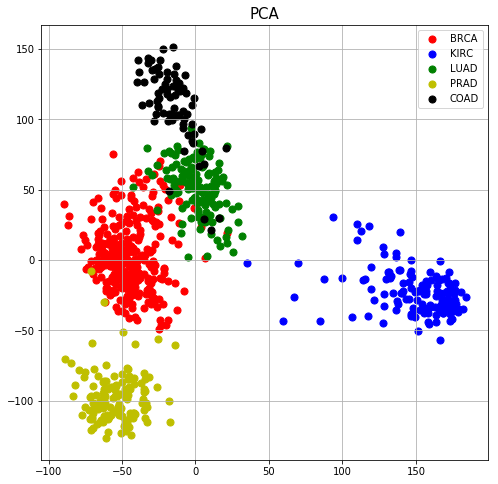
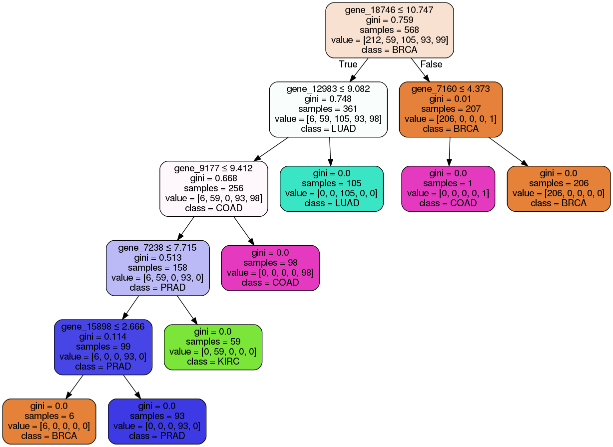

# Gene Expression
---
## Abstract
An overview of RNA sequencing and microarray gene expression analysis. This analysis includes exploring, visualizing and clustering the gene expression data by hierarchically-clustered heatmap, principal component analysis (PCA) and t-distributed Stochastic Neighbor Embedding (t-SNE). The analysis also includes code for cancer classification by using supervised machine learning on gene expression data.    

## Data
The RNA-sequencing gene expression level dataset is a fraction of the Illumina HiSeq dataset from  the cancer genome atlas (TCGA) pan-cancer analysis project (Weinstein, J.N. et al. 2013), and was retrieved from [UCI machine learning repository](https://archive.ics.uci.edu/ml/datasets/gene+expression+cancer+RNA-Seq). The data contains 801 observations, expression levels of 20532 genes, and labels of five cancers; breast (BRCA), kidney (KIRC), lung adeno (LUAD), colon (COAD), and prostate (PRAD). 

## Analysis
The data was first explored by performing hierarchically-clustering, and visualizing the result using a heatmap.

 

### Dimensionality reduction

This dataset contains gene expressions of 20532 genes, corresponding to 20532 dimensions. In order to get an intuition of the data and cluster the data without label information, a dimensionality reduction is performed using PCA and t-SNE.     

PCA was performed using 2 principal components.

t-SNE 

 

### Supervised machine learning for cancer type classification

The dataset was split 70/30, train/test dataset. 
The methods that was used was K-Nearest neighbors classifier, Support Vector Machines (SVM) and Decision Tree (see figure below)

Weinstein, J. N. et al. (2013), 'The Cancer Genome Atlas Pan-Cancer analysis project', Nat Genet 45 (10), 1113-1120. 

